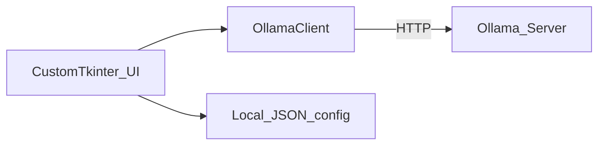

# Ollama Configurator — architecture

## Layout

```
ollama-configurator/
  main.py
  ollama_configurator/
    api.py      # OllamaClient (httpx)
    app.py      # CustomTkinter UI
    config.py   # local JSON settings
  build.sh / build.ps1 / build.bat
  assets/       # png, icns, ico, file_version_info.txt
```

## Data flow



## API mapping

| UI action | API |
|-----------|-----|
| Test connection | `GET /api/version` |
| Installed models | `GET /api/tags` |
| Pull | `POST /api/pull` (stream) |
| Delete | `DELETE /api/delete` |
| Running / VRAM split | `GET /api/ps` (`size`, `size_vram`, `context_length`) |
| Unload | `POST /api/generate` `{keep_alive: 0}` |
| Warm load / reload | unload then `{keep_alive: -1}` |

## Threading

Background threads for HTTP; UI updates via `widget.after(0, …)`. Capture exceptions into a local before deferred callbacks (Python clears `except` vars).

## Version sources

- Runtime/UI: `ollama_configurator.__version__`
- Windows exe: `assets/file_version_info.txt` + `--version-file`
- macOS app: `build.sh` patches `CFBundleShortVersionString` / `CFBundleVersion` after PyInstaller
