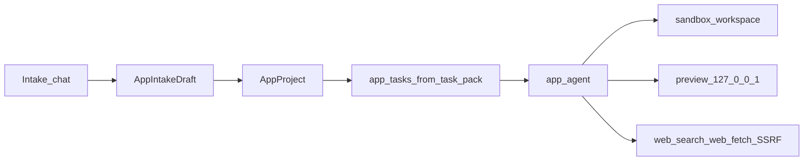

# Skill Builder — product architecture

## High-level shape

```
Browser  →  FastAPI (pages + /api)
                ├── skills / MCP CRUD
                ├── App Agent (Ollama + tools)
                └── SQLite (models imported at startup)
                          ↓
              workspaces/<id>/  +  preview 127.0.0.1:81xx
```

**Principle:** Plan-before-act. Each template seeds `task_pack.json` into `app_tasks`; mutating tools require a `task_id`.

## Layout

```
Skill_builder/
  app/main.py          # FastAPI lifespan, model imports, init_db
  app/routes/          # pages, skills, mcp_servers, apps, chat
  app/services/        # app_agent, app_tasks, web_tools, workspace, preview_manager
  app/templates/app_seeds/   # static | fastapi | todo (+ task_pack.json)
  templates/pages/
  workspaces/          # gitignored sandboxes
  mcp_servers/         # generated MCP trees
  run.py
```

## Data flow (App Agent)



## Lifespan gotcha

`lifespan` must import every SQLAlchemy model **before** `init_db()` / `create_all()`, or tables for apps/runs/tasks never appear.

## Network policy

- App listens on localhost (port scan from 8000)
- Previews bind `127.0.0.1` ports 8100+
- `web_fetch` blocks private/LAN/metadata SSRF

## Shutdown

Stop all preview processes in FastAPI shutdown (`preview_manager.stop_all_previews`).
